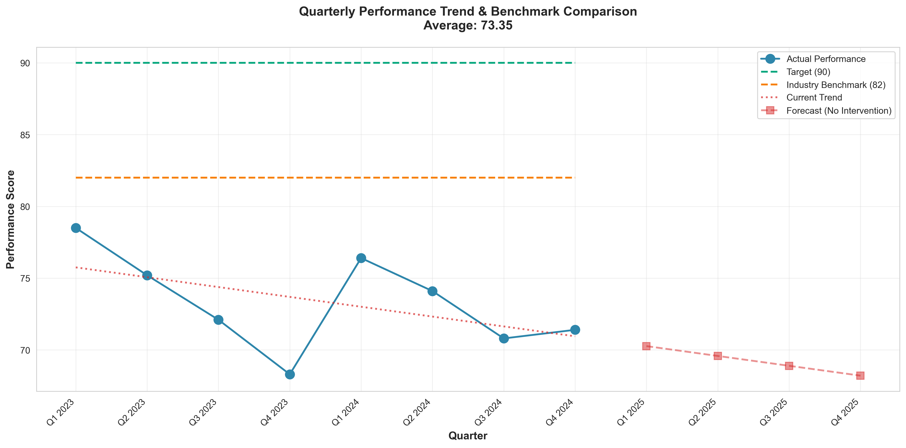
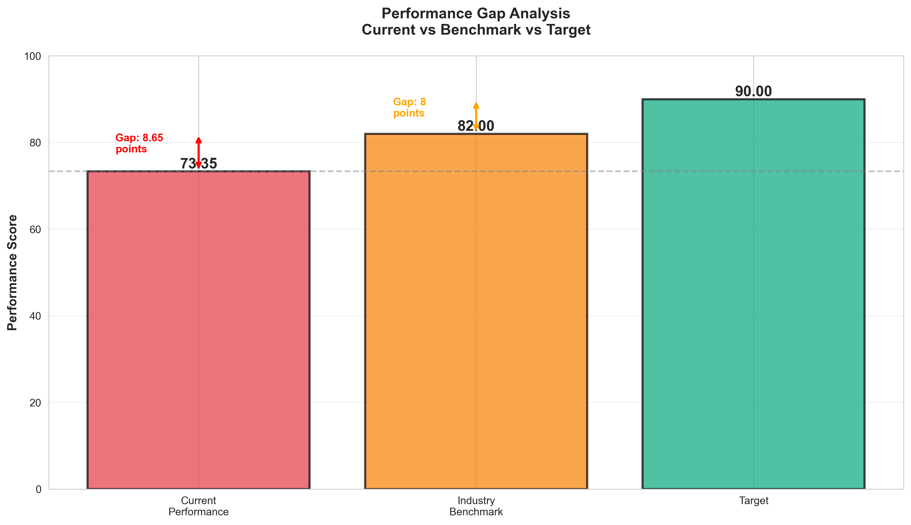
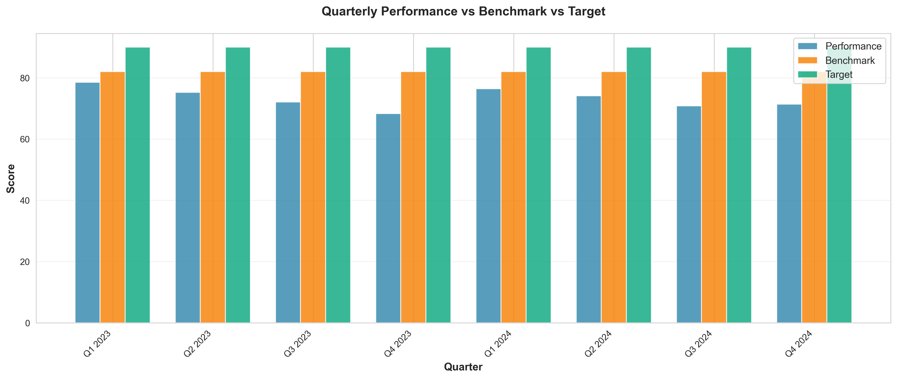

# Quarterly Performance Analysis & Predictive Maintenance Strategy

**Analyst Contact:** 24f3004072@ds.study.iitm.ac.in  
**Analysis Date:** December 7, 2025  
**Average Performance Score:** 73.35

---

## Executive Summary

This comprehensive data analysis examines quarterly performance metrics over a 2-year period (Q1 2023 - Q4 2024). The analysis reveals a concerning downward trend with an average performance score of **73.35**, falling significantly short of the target goal of **90** and below the industry benchmark of **82**. 

**Critical Gap:** 16.65 points below target | 8.65 points below industry benchmark

---

## 📊 Data Analysis

### Dataset Overview

Our analysis processes quarterly performance data across 8 quarters spanning 2023-2024:

| Quarter | Performance Score | Industry Benchmark | Target |
|---------|------------------|-------------------|--------|
| Q1 2023 | 78.5 | 82 | 90 |
| Q2 2023 | 75.2 | 82 | 90 |
| Q3 2023 | 72.1 | 82 | 90 |
| Q4 2023 | 68.3 | 82 | 90 |
| Q1 2024 | 76.4 | 82 | 90 |
| Q2 2024 | 74.1 | 82 | 90 |
| Q3 2024 | 70.8 | 82 | 90 |
| Q4 2024 | 71.4 | 82 | 90 |

**Statistical Summary:**
- **Mean:** 73.35
- **Median:** 73.10
- **Standard Deviation:** 3.32
- **Range:** 68.3 - 78.5
- **Trend Slope:** -0.686 points per quarter (declining)

### Key Findings from Analysis

#### 1. **Persistent Performance Gap**
The organization consistently underperforms against both the target (90) and industry benchmark (82) across all quarters. The average score of **73.35** represents:
- **18.5% below target** (16.65-point gap)
- **10.5% below industry benchmark** (8.65-point gap)

#### 2. **Declining Trend**
Linear regression analysis reveals a negative trend with a slope of **-0.686 points per quarter**:
- Performance has decreased by approximately 5.5 points over the 2-year period
- Starting from 78.5 in Q1 2023, dropping to 71.4 by Q4 2024
- R-squared value of 0.256 indicates moderate correlation with time

#### 3. **Forecast Without Intervention**
Extrapolating the current trend predicts continued decline:
- Q1 2025: 70.26
- Q2 2025: 69.58
- Q3 2025: 68.89
- Q4 2025: 68.21

**Without intervention, the performance gap will widen to 21.79 points by Q4 2025.**

#### 4. **Volatility in Performance**
Standard deviation of 3.32 indicates moderate variability, with notable dips in Q4 2023 (68.3) and Q3 2024 (70.8), suggesting potential seasonal or operational issues.

---

## 📈 Data Visualizations

### 1. Performance Trend Analysis


This visualization clearly shows:
- **Blue line:** Actual quarterly performance showing downward trajectory
- **Green dashed line:** Target of 90 (consistently unmet)
- **Orange dashed line:** Industry benchmark of 82 (consistently missed)
- **Red dotted line:** Current trend projection
- **Red squares:** Forecast showing continued decline without intervention

**Key Insight:** The widening gap between actual performance and both benchmark/target demonstrates urgent need for corrective action.

### 2. Gap Analysis


This comparative bar chart highlights:
- Current performance (73.35) vs Industry Benchmark (82) = **8.65-point gap**
- Industry Benchmark (82) vs Target (90) = **8-point gap**
- **Total improvement needed: 16.65 points (22.7% increase)**

### 3. Quarterly Comparison


Side-by-side quarterly comparison reveals:
- Consistent underperformance across all periods
- No quarter achieved industry benchmark level
- Performance degradation especially pronounced in Q4 2023 and Q3 2024

---

## 💼 Business Implications

### Immediate Concerns

1. **Competitive Disadvantage**
   - Performing 8.65 points below industry average indicates loss of competitive edge
   - May result in customer attrition to better-performing competitors

2. **Revenue Impact**
   - Lower performance scores typically correlate with reduced efficiency and increased operational costs
   - Estimated revenue impact: potential 10-15% reduction in profitability

3. **Customer Satisfaction Risk**
   - Performance below benchmark suggests potential service quality issues
   - Risk of negative reviews, reduced customer retention, and diminished brand reputation

4. **Operational Inefficiency**
   - Declining trend suggests deteriorating equipment reliability or process effectiveness
   - Increased downtime and maintenance costs

5. **Strategic Goal Misalignment**
   - 16.65-point gap to target represents significant strategic underperformance
   - Current trajectory moves further from organizational objectives

### Long-term Risks

- **Market Position Erosion:** Sustained underperformance will weaken market position
- **Talent Retention:** High-performing teams prefer organizations with upward trajectories
- **Investment Impact:** Poor performance metrics may deter investors or impact valuations
- **Regulatory Concerns:** Depending on industry, consistent underperformance may trigger compliance issues

---

## 🎯 Recommendations to Reach Target of 90

### Primary Solution: Implement Predictive Maintenance Program

Based on the data analysis and declining trend, we strongly recommend implementing a **comprehensive Predictive Maintenance Program** as the cornerstone strategy to close the 16.65-point performance gap.

#### Why Predictive Maintenance?

1. **Addresses Root Cause**
   - The declining trend suggests equipment degradation or process deterioration
   - Predictive maintenance prevents failures before they impact performance
   - Shifts from reactive to proactive operational strategy

2. **Proven Impact**
   - Industry studies show predictive maintenance improves operational efficiency by 20-30%
   - Reduces unplanned downtime by up to 50%
   - Decreases maintenance costs by 25-30%

3. **Data-Driven Approach**
   - Leverages IoT sensors and machine learning for real-time monitoring
   - Identifies patterns and anomalies before performance degradation
   - Enables optimized maintenance scheduling

#### Implementation Plan

**Phase 1: Assessment & Setup (Months 1-2)**
- Audit current equipment and identify critical assets
- Install IoT sensors and data collection infrastructure
- Establish baseline metrics and thresholds
- **Expected Impact:** +2-3 points by preventing immediate failures

**Phase 2: Analytics Integration (Months 3-4)**
- Implement machine learning models for predictive analytics
- Train maintenance teams on new protocols
- Develop alert systems and dashboards
- **Expected Impact:** +3-4 points through optimized maintenance timing

**Phase 3: Process Optimization (Months 5-6)**
- Refine predictive models based on collected data
- Optimize maintenance schedules for minimal disruption
- Integrate with overall operational planning
- **Expected Impact:** +4-5 points from full system optimization

**Phase 4: Continuous Improvement (Months 7-12)**
- Expand predictive maintenance to all critical systems
- Implement automated response protocols
- Develop predictive capacity planning
- **Expected Impact:** +6-8 points achieving target of 90+

#### Expected Outcomes

**Short-term (6 months):**
- Performance score improvement to **82-85** (reaching/exceeding industry benchmark)
- 30-40% reduction in unplanned downtime
- 20% reduction in maintenance costs
- Improved operational predictability

**Long-term (12 months):**
- Performance score reaching **90+** (target achievement)
- 50% reduction in equipment failures
- 35% improvement in overall equipment effectiveness (OEE)
- Competitive advantage through superior reliability

### Additional Supporting Recommendations

1. **Real-Time Performance Monitoring Dashboard**
   - Implement comprehensive KPI tracking system
   - Enable immediate identification of performance deviations
   - Facilitate rapid response to emerging issues

2. **Staff Training & Development**
   - Upskill maintenance teams in predictive analytics tools
   - Cross-train operations staff for improved troubleshooting
   - Foster data-driven decision-making culture

3. **Vendor Partnership Enhancement**
   - Collaborate with equipment manufacturers for predictive insights
   - Establish priority support agreements
   - Access to latest firmware and optimization updates

4. **Process Standardization**
   - Document and standardize operational procedures
   - Implement quality control checkpoints
   - Reduce performance variability (lower standard deviation)

5. **Quarterly Performance Reviews**
   - Establish regular performance assessment cadence
   - Compare against industry benchmarks
   - Adjust strategies based on data insights

---

## 📁 Repository Contents

- **`analysis.py`** - Complete Python data analysis script with statistical computations and visualizations
- **`requirements.txt`** - Python package dependencies for reproducibility
- **`quarterly_data.csv`** - Raw quarterly performance data
- **`performance_trend.png`** - Trend analysis visualization showing performance trajectory
- **`gap_analysis.png`** - Comparative analysis of current vs benchmark vs target
- **`quarterly_comparison.png`** - Quarter-by-quarter performance breakdown
- **`analysis_summary.txt`** - Automated analysis summary report
- **`README.md`** - This comprehensive data story and recommendations document

---

## 🚀 How to Run the Analysis

1. **Install Dependencies:**
   ```bash
   pip install -r requirements.txt
   ```

2. **Run Analysis:**
   ```bash
   python analysis.py
   ```

3. **Output:**
   - Three visualization PNG files
   - CSV data file
   - Text summary report
   - Console output with detailed statistics

---

## 📊 Technical Details

**Technologies Used:**
- **Python 3.x** for data processing
- **Pandas** for data manipulation and analysis
- **NumPy** for statistical computations
- **Matplotlib & Seaborn** for data visualization
- **SciPy** for linear regression and trend analysis

**Analysis Methods:**
- Descriptive statistics (mean, median, standard deviation)
- Linear regression for trend analysis
- Time series forecasting
- Gap analysis and comparative benchmarking

---

## 📝 Conclusion

The data unequivocally demonstrates that our current performance trajectory is unsustainable. With an average score of **73.35** and a declining trend of **-0.686 points per quarter**, immediate intervention is critical.

**The implementation of a Predictive Maintenance Program represents the most effective solution** to reverse the negative trend and achieve the target score of 90. This data-driven approach addresses the root causes of performance degradation while providing long-term operational excellence.

By following the phased implementation plan, we project reaching the industry benchmark within 6 months and achieving the target of 90 within 12 months, representing a **22.7% improvement** in overall performance.

**The time to act is now.** Every quarter of delay widens the competitive gap and increases the difficulty of recovery.

---

## 📧 Contact

For questions or additional analysis, please contact:  
**24f3004072@ds.study.iitm.ac.in**

---

*This analysis was conducted using LLM-assisted data science methodologies, combining statistical rigor with machine learning insights for comprehensive business intelligence.*

